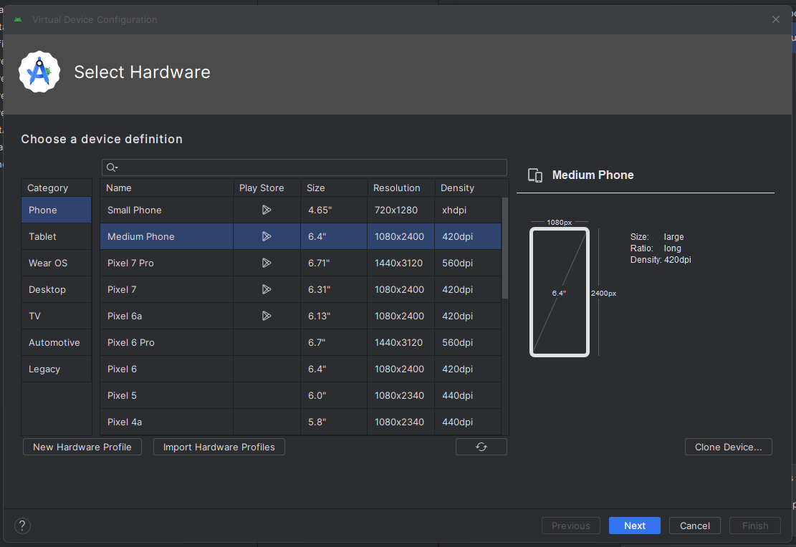

# MobileAutomationTask
Test Automation: Practical and Questionnaire Assignment

# Question
Question 1: Mobile Automation task
Todoist App
At the stage of developing these tests, please think over the overall architecture that it will be huge scalable test 
environment growing with additional tests.

Useful Links:
  Official website :https://en.todoist.com/
  APK : https://todoist.en.uptodown.com/android
  
Please follow these instructions when designing and delivering your solution:
Create test user manually. Use Android emulator for tests.

It is very important, that you have smart designed checks on each step, not only in the end of the whole flow.
For Automation Framework you can use appium or similar framework. 
Please do not use for test creation postman and other similar clients. 
When creating an automation test, you should only use the custom REST client, that you create from scratch.
DO NOT use the official ones.

Please write the automation test in one file. 
  1. Test “Create Project”
  2. Create test project via API.
  3. Login into mobile application.
  4. Verify on mobile that project is created
  5. Test “Create Task via mobile phone”
  6. Create test task via mobile application in test project.
  7. API: Verify that task created correctly.
  8. Test “Reopen Task”
  9. Open mobile application
  10. Open test project
  11. Created test task
  12. Complete test task.
  13. Reopen test task via API.
  14. Mobile: Verify that test task appears in your test project.

# What is Appium?
1. Appium is an open source tool to automate mobile applications.
2. Appium can automate Native, web and hybrid mobile applications.
3. Appium also support Android, iOS and Windows desktop platforms.
4. Appium suppports multiple programming languages.
     1. Java
     2. Python
     3. C#
     4. JavaScript
     5. Ruby
     6. PHP
     7. Robot Framework

# How Appium works?
1. Appium works in a client - server architecture.
2. Appium is a 'HTTP Server' written using - Node.js platform.

3. Desired Capabilities - Desired capabilities are a set of keys and values sent to the Appium server to tell the server what kind od automation session we are interested in starting up.

# Prerequisite to use Appium (Windos)
Pre-requisites  (https://www.youtube.com/watch?v=x_5bc72GQco&list=PLUDwpEzHYYLsx_2JFNBMITjHqTnuszhb_&index=2&ab_channel=SDET-QA)
1. Install Java
2. Eclipse
3. Mave plugin for Eclipse
4. TestNG plugin for Eclipse
5. Selenium Standalone Server
Android Tools
1. Android Studio
2. Appium Server/Appium Desktop
3. Appium Client Library

# How to run the emulator
1. Open android studio run the emulator *Please select a andriod device with Play Store icon, otherwise you are not able to Sign in using Google. 

2. Open appium server and run it
3. Open cmd and cd to "C:\Users\"YourUserName"\AppData\Local\Android\Sdk\platform-tools" then type adb.exe devices -> it will show you the list of devices attached emulator-5554 device

# How to the Appium server
1. Open Appium Desktop.
2. Go to Advanced and set as below:

3. Click start server button.

# How to run the test with Eclipse IDE
1. Open the project and find a file called "pom.xml"
2. Right click your mouse select point to "Run as" and select "Maven clean".
3. Click the save icon on the top navigation bar, Eclipse will download all the dependencies you needed in this project.
4. Open TodoitsMobileTest.java right click the mouse and move to "Run as" and select "TestNG test".

